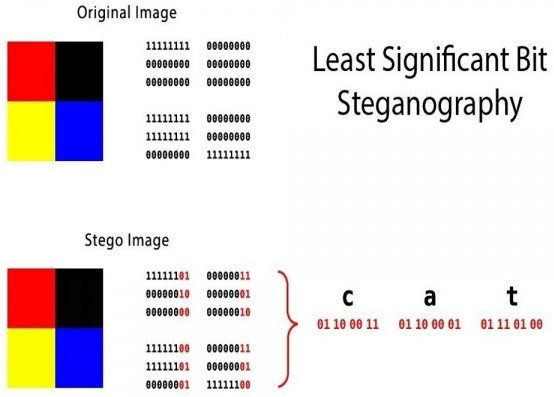
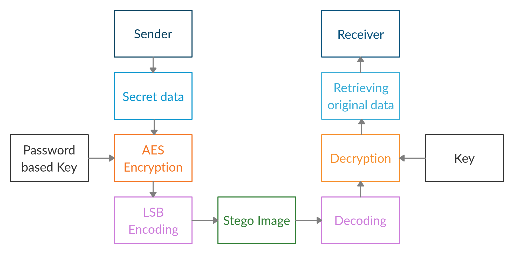
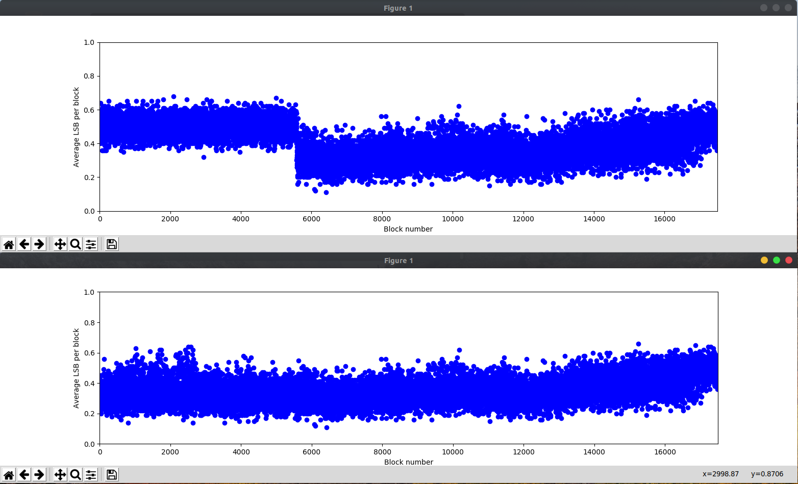

# SteganoCrypt


A tool that focuses on secured embedding of data inside an image using LSB Steganography and AES Encryption such that it will be extremely hard to detect, extract, and decode the hidden data.

### Features:

 - Encrypt the data before embeddeing to ensure highest level of security. 
 - Embed within LSBs.
 - Extract and decrypt hidden data.
 - Basic analysis of images to detect LSB steganography.

### Algorithm:
- Least Significant Bit encoding is used to embed data inside image. <newline>
- 
- AES-256 bit Encryption with Password based key generation

### Block Diagram


----
## How to use:

    $ python SteganoCrypt.py --help
     Guided mode: use 'python SteganoCrypt.py'
     Manual mode Usage: 
      SteganoCrypt.py hide <img_file> <payload_file> <password>
      SteganoCrypt.py extract <stego_file> <out_file> <password>
      SteganoCrypt.py analyse <stego_file>


## Two modes to use:

- ### Guided Mode: 
    - Run the program without runtime arguments.
    - `python SteganoCrypt.py`
    - It will prompt a menu driven interface to use the tool. 
```
$ python SteganoCrypt.py

============================================================
||                     STEGANOCRYPT                       ||
============================================================
 [1] Hide data in image
 [2] Extract data from image
 [3] Analyse steganographic image
 [4] Exit
Enter your choice: 1
Enter image name: image.jpg
Enter filename of data file to hide: secret_messag.txt
[-] Data file does not exist. Recheck the file name. 
Enter filename of data file to hide: secret_message.txt
Enter password for encryption: Passw0rd
[*] Input image size: 1080x1620 pixels.
[*] Usable payload size: 640.72 KB.
[+] Payload size: 90.309 KB 
[+] Encrypted payload size: 90.332 KB 
[+] secret_message.txt embedded successfully!
```

- ### Manual Mode
    - Run the program with instructions and file names in the runtime arguments.
    - Run  `python SteganoCrypt.py --help`
    ```
    $ python SteganoCrypt.py --help
     Guided mode: use 'python SteganoCrypt.py'
     Manual mode Usage: 
      SteganoCrypt.py hide <img_file> <payload_file> <password>
      SteganoCrypt.py extract <stego_file> <out_file> <password>
      SteganoCrypt.py analyse <stego_file>
    ```
----

## Hide

Encrypt and hide data:
```
$ python SteganoCrypt.py

============================================================
||                     STEGANOCRYPT                       ||
============================================================
 [1] Hide data in image
 [2] Extract data from image
 [3] Analyse steganographic image
 [4] Exit
Enter your choice: 1
Enter image name: image.jpg
Enter filename of data file to hide: secret_message.txt
Enter password for encryption: PassW0rd
[*] Input image size: 1080x1620 pixels.
[*] Usable payload size: 640.72 KB.
[+] Payload size: 90.309 KB 
[+] Encrypted payload size: 90.332 KB 
[+] secret_message.txt embedded successfully!
```
 
Original image (843 KB): 


Image with 367KB of text data embedded:


 
## Extract
- Extract and decrypt the data:
```
    $ python SteganoCrypt.py extract image-stego.png output.txt Passw0rd
    [+] Image size: 1080x1620 pixels.
    [+] Written extracted data to output.txt.
```

## Analyse

- The image is split into blocks, and average of LSBs of each block is calculated. 
- If the LSBs contain encrypted data, the tampered regions of image will have the average of LSBs around 0.5.
- This can be visualised with the help of the analyse command.

    `$ python SteganoCrypt.py analyse image-stego.png`

**Example**

Now let’s analyse the stego image with original one:

The first graph shows the analysis of LSBs of stego image. The second graph is of original image. We can see the average of LSBs of stego image is close to 0.5 in the region where the data is embedded.




